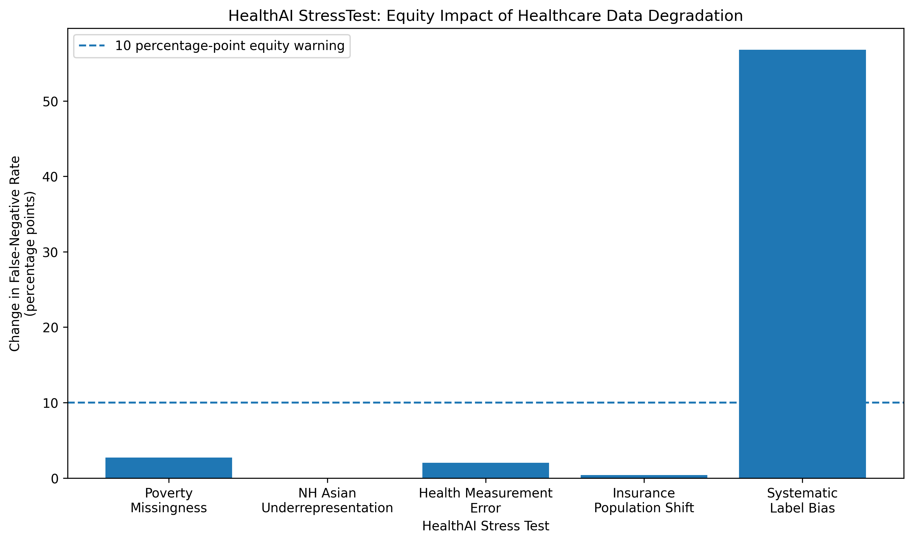

# HealthAI StressTest

### Stress-testing healthcare prediction models for hidden equity failures under realistic data degradation

Healthcare prediction models can appear accurate overall while performing very differently across patient populations.

**HealthAI StressTest** is an experimental health equity and responsible-AI project that asks a different question from a standard machine-learning analysis:

> **What happens when we deliberately break the data used to train a healthcare prediction model?**

Using nationally representative U.S. healthcare data, I built a baseline model to classify adults with high annual healthcare expenditures and systematically introduced realistic data-quality failures.

The goal was to determine whether overall model performance could remain relatively stable while errors became concentrated within specific demographic or socioeconomic populations.

---

## Key Finding

The model was relatively resilient to several isolated forms of training-data degradation.

However, **systematic bias in the outcome labels used to train the model produced a major equity failure.**

When high healthcare expenditures among lower-income adults were increasingly misclassified in the training data:

- Lower-income false-negative rate increased from **26.5% to 83.3%**
- Higher-income false-negative rate remained approximately **25%**
- The income-group false-negative-rate gap increased from **1.3 to 58.0 percentage points**
- The first tested condition exceeding the project's **10-percentage-point equity-warning threshold occurred at 25% label error**
- At that point, overall false-negative rate increased by only **1.6 percentage points**, while lower-income false-negative rate had already reached **38.1%**

This demonstrates how **aggregate model metrics can conceal substantial subgroup harm**.


---

## Research Questions

### Primary Question

> **How rapidly do subgroup performance disparities worsen when healthcare training data are systematically degraded?**

### Secondary Question

> **Can overall predictive performance remain apparently acceptable while subgroup equity deteriorates?**

---

## Data

This project uses the **2024 Medical Expenditure Panel Survey (MEPS) Full-Year Consolidated File**, released by the Agency for Healthcare Research and Quality in 2026.

MEPS contains nationally representative information on:

- healthcare expenditures
- healthcare utilization
- demographics
- income and poverty status
- insurance coverage
- physical health
- mental health
- chronic conditions

### Analytic Sample

After restricting the dataset to adults age 18+ with valid values for the baseline predictors:

- **Total analytic sample:** 14,666
- **Training sample:** 10,266
- **Testing sample:** 4,400

Race/ethnicity distribution in the analytic sample:

| Group | N |
|---|---:|
| Hispanic | 2,806 |
| Non-Hispanic White | 8,741 |
| Non-Hispanic Black | 1,833 |
| Non-Hispanic Asian | 834 |
| Non-Hispanic Other/Multiple Race | 452 |

The MEPS person-level survey weight was incorporated into model fitting and performance calculations.

The raw MEPS dataset is **not included in this repository** and can be obtained directly from AHRQ.

---

## Outcome

The model classified whether an adult had **high annual healthcare expenditures**.

High-cost status was defined as:

> Annual healthcare expenditures at or above the **survey-weighted 80th percentile** of expenditures in the training sample.

The resulting expenditure threshold was:

## **$11,223**

Weighted prevalence of the high-cost outcome:

- Training: **20.0%**
- Testing: **20.6%**

Because predictors and expenditures were measured within the same year, this project should be interpreted as a **risk-classification and model-robustness experiment**, rather than a prospective model predicting future expenditures.

---

## Baseline Model

A survey-weighted **logistic regression model** was used as the primary classifier.

### Predictors

The model included:

- age
- sex
- poverty category
- education
- insurance coverage
- self-rated physical health
- self-rated mental health
- hypertension
- diabetes

### Equity Design Choice

**Race/ethnicity was intentionally excluded as a model predictor.**

Instead, race/ethnicity was retained exclusively for subgroup performance auditing.

This allowed the project to examine whether a model that does not explicitly use race could still exhibit substantial racial/ethnic differences in predictive performance.

---

## Baseline Model Performance

The analytic dataset was split into:

- **70% training**
- **30% testing**

The baseline model achieved:

| Metric | Value |
|---|---:|
| Training AUC | 0.777 |
| Testing AUC | 0.760 |

The relatively small difference between training and testing AUC suggested reasonable generalization without severe overfitting.

The classification threshold was selected using **Youden's J statistic on the training sample** and then frozen for subsequent stress tests.

---

# Baseline Equity Audit

Before intentionally degrading the data, the model was evaluated separately across racial/ethnic groups.

Performance metrics included:

- AUC
- sensitivity
- specificity
- positive predictive value
- false-negative rate
- Brier score
- mean predicted-versus-observed risk gap

### Baseline Results

| Group | AUC | Sensitivity | Specificity | PPV | FNR |
|---|---:|---:|---:|---:|---:|
| Overall | 0.760 | 74.6% | 64.0% | 35.0% | 25.4% |
| Hispanic | 0.783 | 67.5% | 76.9% | 32.2% | 32.5% |
| NH White | 0.741 | 75.8% | 59.1% | 38.3% | 24.2% |
| NH Black | 0.834 | 87.2% | 65.0% | 30.8% | 12.8% |
| NH Asian | 0.645 | 52.0% | 63.9% | 14.7% | 48.0% |
| NH Other/Multiple | 0.764 | 62.8% | 66.6% | 29.6% | 37.2% |

A substantial disparity was already present before any artificial data degradation.

The maximum racial/ethnic false-negative-rate difference was:

## **35.3 percentage points**

The NH Asian subgroup had the highest baseline false-negative rate at **48.0%**.

These subgroup results should be interpreted cautiously, particularly for smaller test samples such as NH Asian and NH Other/Multiple adults.

---

# The Five Crash Tests

## Crash Test 1 — Selective Poverty-Data Missingness

### Question

What happens when socioeconomic information becomes increasingly incomplete specifically for lower-income adults?

Poverty-category information was removed from progressively larger percentages of lower-income participants in the **training set only**.

Missingness levels:

- 0%
- 10%
- 25%
- 50%
- 75%
- 100%

Missing values were handled through the model preprocessing pipeline.

The test population remained unchanged.

### Result

At 100% selective poverty-category missingness:

- Lower-income FNR: **26.5% → 29.2%**
- Change: **+2.7 percentage points**

Higher-income FNR changed only slightly.

### Interpretation

**No material additional degradation detected.**

The model was relatively resilient to isolated loss of poverty-category information.

---

## Crash Test 2 — Racial/Ethnic Underrepresentation

### Question

Does reducing representation of an already poorly performing subgroup make its model performance substantially worse?

NH Asian adults were progressively removed from the training dataset while the test population remained unchanged.

Training representation levels:

- 100%
- 75%
- 50%
- 25%
- 10%

Each degraded representation scenario was evaluated across **50 repeated simulations** to distinguish systematic effects from random sampling variation.

### Result

NH Asian performance remained remarkably stable.

| NH Asian Training Representation | Mean AUC | Mean Sensitivity | Mean FNR |
|---:|---:|---:|---:|
| 100% | 0.645 | 52.0% | 48.0% |
| 75% | 0.644 | 52.0% | 48.0% |
| 50% | 0.643 | 52.0% | 48.0% |
| 25% | 0.643 | 52.0% | 48.0% |
| 10% | 0.643 | 52.0% | 48.0% |

### Interpretation

**No material additional degradation detected.**

The baseline NH Asian performance disparity was not explained simply by the number of NH Asian observations represented in the training dataset.

This result does **not** imply that demographic underrepresentation is harmless in healthcare AI generally. It applies only to this dataset, outcome, predictor set, model, and experimental design.

---

## Crash Test 3 — Measurement Error

### Question

How robust is the model to realistic reporting error in self-rated physical health?

Increasing percentages of self-rated physical-health values were intentionally shifted by one plausible response category.

For example:

- Excellent → Very good
- Good → Fair
- Fair → Good
- Poor → Fair

Measurement-error levels:

- 0%
- 5%
- 10%
- 20%
- 30%
- 40%

Each scenario was repeated across **50 simulations**.

### Result

Even at 40% measurement error, subgroup false-negative rates changed relatively little.

The largest mean subgroup FNR deterioration was approximately:

## **+2.0 percentage points**

### Interpretation

**No material additional degradation detected.**

The model appeared relatively robust to isolated measurement error in this predictor.

---

## Crash Test 4 — Population Shift

### Question

What happens when a healthcare model is developed in one insurance population and deployed in another?

Two models were compared on the **exact same test population of 1,803 adults with public insurance or no insurance**.

### Model A — Representative Training

Trained using the full training population.

### Model B — Private-Only Training

Trained using privately insured adults only.

Insurance status itself was removed from the predictor set for this experiment so the comparison focused on differences in the development population.

### Results

| Metric | Representative Training | Private-Only Training |
|---|---:|---:|
| AUC | 0.774 | 0.771 |
| Sensitivity | 83.2% | 82.8% |
| Specificity | 56.5% | 54.3% |
| PPV | 35.7% | 34.5% |
| FNR | 16.8% | 17.2% |
| Mean risk gap | 0.017 | 0.022 |
| Brier Score | 0.146 | 0.147 |

### Interpretation

**No material additional degradation detected.**

Insurance-based population shift produced only modest deterioration in this model.

---

# Crash Test 5 — Systematic Label Bias

## Question

What happens when the training dataset systematically teaches the model the wrong outcome for a disadvantaged population?

Among lower-income adults who were genuinely high cost, increasing percentages of positive training labels were deliberately changed from:

`HIGH_COST = 1`

to:

`HIGH_COST = 0`

This simulated systematic under-recording or misclassification of high healthcare expenditures among lower-income adults.

Label-error levels:

- 0%
- 10%
- 25%
- 50%
- 75%

Each scenario was evaluated across **50 simulations**.

The test dataset remained unchanged and retained the correct outcomes.

---

## Label-Bias Results

| Label Error | Higher-Income FNR | Lower-Income FNR | FNR Gap | Overall FNR |
|---:|---:|---:|---:|---:|
| 0% | 25.2% | 26.5% | 1.3 pp | 25.4% |
| 10% | 25.0% | 30.7% | 5.7 pp | 25.9% |
| 25% | 25.0% | 38.1% | **13.1 pp** | 27.0% |
| 50% | 25.2% | 55.0% | **29.9 pp** | 29.6% |
| 75% | 25.3% | 83.3% | **58.0 pp** | 33.9% |


---

## Equity Failure Threshold

For this project, a **10-percentage-point subgroup FNR gap** was pre-specified as an exploratory equity-warning threshold.

The first tested scenario exceeding that threshold occurred at:

# **25% systematic label error**

At that level:

- Overall FNR increased from **25.4% to 27.0%**
- Overall deterioration: only **+1.6 percentage points**
- Lower-income FNR increased from **26.5% to 38.1%**
- Lower-income deterioration: **+11.6 percentage points**
- Income-group FNR gap reached **13.1 percentage points**

This is the central finding of HealthAI StressTest.

A monitoring system focused only on overall performance could have interpreted the model as relatively stable even though a meaningful subgroup failure had already emerged.

---

# Stress-Test Summary



| Experiment | Primary Equity Result | Status |
|---|---|---|
| Baseline Audit | 35.3 pp max racial/ethnic FNR gap | **BASELINE DISPARITY** |
| Crash 1: Poverty Missingness | +2.7 pp lower-income FNR | No material additional degradation |
| Crash 2: Underrepresentation | +0.0 pp NH Asian FNR | No material additional degradation |
| Crash 3: Measurement Error | +2.0 pp largest subgroup FNR | No material additional degradation |
| Crash 4: Population Shift | +0.4 pp deployment FNR | No material additional degradation |
| **Crash 5: Systematic Label Bias** | **+56.8 pp lower-income FNR** | **EQUITY FAILURE** |

---

# What the Experiment Suggests

The stress tests produced three important observations.

## 1. Baseline equity auditing matters

The model exhibited substantial subgroup differences **before artificial degradation was introduced**.

A model can therefore perform reasonably well overall while providing very different levels of reliability across patient populations.

---

## 2. Not all data-quality failures are equally harmful

In this experiment:

- predictor missingness produced limited additional deterioration
- subgroup underrepresentation produced limited additional deterioration
- isolated measurement error produced limited additional deterioration
- insurance-based population shift produced limited additional deterioration
- **systematic bias in training labels produced severe subgroup harm**

The experiment therefore suggests that healthcare AI evaluation should examine not only **who is represented in the data**, but also **how outcomes are measured, captured, and labeled across populations**.

---

## 3. Aggregate performance can hide subgroup failure

Crash Test 5 provides the clearest example.

At 25% systematic label error:

### Overall FNR

**25.4% → 27.0%**

Only a:

**+1.6 percentage-point increase**

But:

### Lower-Income FNR

**26.5% → 38.1%**

A:

**+11.6 percentage-point deterioration**

A model-monitoring process based only on aggregate performance could therefore miss an emerging subgroup failure.

---

# Methods Summary

## Modeling

- survey-weighted logistic regression
- 70/30 train/test split
- survey-weighted definition of high-cost status
- high-cost threshold derived using training data only
- preprocessing through scikit-learn pipelines
- standardized continuous predictors
- one-hot encoded categorical predictors
- missing-value imputation for stress-test scenarios
- classification threshold selected using training data only
- classification threshold frozen during stress testing

## Equity and Performance Metrics

- area under the ROC curve
- sensitivity
- specificity
- positive predictive value
- false-negative rate
- Brier score
- mean predicted-versus-observed risk gap
- subgroup false-negative-rate differences

## Robustness Design

Where random sampling or corruption was involved, stress tests were repeated across multiple simulations to distinguish systematic effects from individual random draws.

Crash Tests 2, 3, and 5 used **50 repeated simulations per experimental condition**.

---

# Repository Structure

```text
HealthAI-StressTest/
│
├── README.md
├── HealthAI_StressTest.ipynb
├── LICENSE
├── .gitignore
│
├── figures/
│   ├── healthai_crash_test_summary.png
│   └── healthai_label_bias_equity_failure.png
│
└── results/
    ├── healthai_final_summary.csv
    ├── healthai_baseline_equity_audit.csv
    └── healthai_label_bias_results.csv
